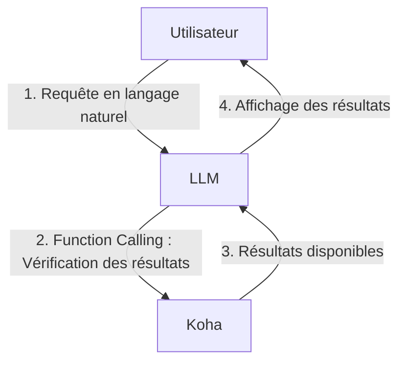

# **Plugin Koha LLM Search**
### Intégration d’un assistant conversationnel dans l’OPAC Koha

---
## **1. Introduction**
- **Objectif** : Permettre aux utilisateurs de rechercher en langage naturel dans Koha.
- **Fonctionnement** : Bouton "Robot" dans l’OPAC → Chat → Génération de liens vers des résultats de recherche.
- **Compatibilité** : Mistral, Ollama, ou tout service compatible OpenAI API.

---
## **2. Architecture et Concept**
- Le LLM traduit la requête utilisateur en URL de recherche Koha.
- **Function Calling** : Vérifie la disponibilité des résultats dans le catalogue local.
- **Exemple** :
  - Utilisateur : *"Je cherche des livres sur l’écologie."*
  - LLM : Génère une URL de recherche (su="écologie) + vérifie les résultats disponibles.
  - Si résultats : le LLM formule une réponse contenant le lien.
  - Si pas de résultat : propose de reformuler la requète.

---
## **3. Schéma de Principe**

----
## **Le Function Calling : interaction entre LLM et Koha**
- Le **Function Calling** est une technique qui permet à un **Large Language Model (LLM)** d'**appeler des fonctions** pour récupérer des données en temps réel, exécuter des actions ou vérifier des informations.
---
## **Avantages du Function Calling**

- **Temps réel** : Interroge directement le catalogue Koha pour des résultats à jour.
- **Flexibilité** : Pas besoin d'entraîner ou de mettre à jour un modèle.
- **Moins coûteux** : Évite les coûts liés au fine-tuning ou à la gestion d'une base RAG.
- **Précision** : Vérifie la disponibilité réelle des documents.
---
## **4. Configuration**
- **Clé API** : Obligatoire (Mistral, Ollama, etc.).
- **Prompt système** : Personnalisable pour adapter les réponses.
- **Restrictions** : Accès limité aux utilisateurs connectés ou à certaines catégories.
- **Journalisation** : Statistiques d’utilisation (tokens, catégories, etc.).

---
## **5. Statistiques et Sécurité**
- **Données collectées** : Date d'utilisation, année de naissance de l'usager, catégorie de lecteur, bibliothèque, nombre de tokens.
- **Non stockées** : Requêtes utilisateurs et réponses LLM.
- **Risques** : Coûts, confidentialité, biais.
- **Recommandations** : Tester en environnement contrôlé avec un nombre limité d'utilisateurs.

---
## **6. Limitations & Usages**
Ne remplace pas un bibliothécaire:
- N'est pas un expert de la recherche ni de Koha et ne connaît pas la configuration de l'indexation.
- Parfois utilise index "sujet" là où un index "mot-clé" ou "auteur" serait plus pertinent.
- N'a aucune connaissance du fond!
- Un levier pour attirer les lecteurs vers une utilisation "guidée" de l'OPAC?
- Un outils de médiation pour initier le public à l'usage des LLM et en discuter?

---
## **7. Conclusion**
- **Avantages** : Accessibilité, modernisation de l’OPAC.
- **Prochaines étapes** : Test, formation, suivi des statistiques.

---
### **Merci !**
Des questions ?
